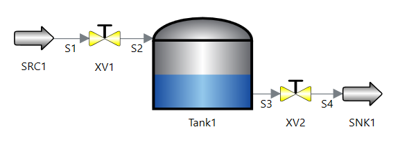
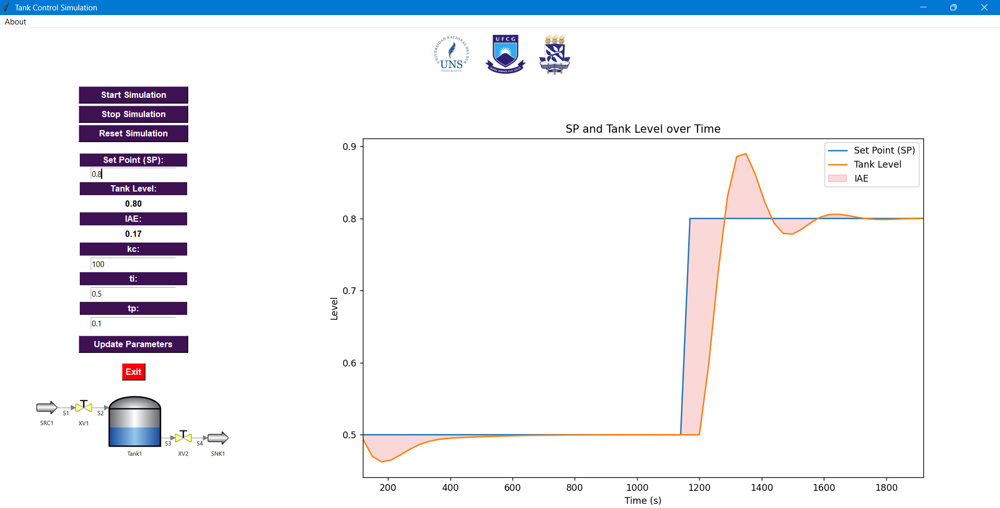

# Tank Level GUI

**Tank Level GUI** es una interfaz gráfica de usuario (GUI) desarrollada en Python para la implementación de un controlador PI externo aplicado a un proceso dinámico simulado en AVEVA Process Simulation (APS). Esta herramienta permite la conexión en tiempo real con el entorno de simulación, facilitando el control y monitoreo de un sistema de nivel de tanque.

---

## Características principales

- Conexión directa con APS mediante la API `simcentralconnect` (basada en .NET Framework).
- Importación automática del modelo dinámico.
- Implementación de control proporcional-integral (PI) externo.
- Visualización en tiempo real.
- Modificación dinámica de parámetros de control y set points.
- Cálculo de la acción de control respetando restricciones físicas.
- Interfaz intuitiva construida con Tkinter.

---

## Requisitos

⚠️ Importante: Antes de ejecutar la GUI, asegurate de tener AVEVA Process Simulation (APS) abierto.

### Opción 1: Ejecutar directamente (recomendado para usuarios finales)
- Ejecutar el archivo que se encuentra en `tank_gui/dist/Tank_Level_GUI.exe`.

### Opción 2: Ejecutar desde código (recomendado para desarrolladores)
- Python 3.8 o superior
- Dependencias:
  - `simcentralconnect` (requiere entorno APS instalado)
  - `tkinter` 
  - `PIL` 
  - `matplotlib` 

---

## Capturas y demostración

### Modelo del tanque



### Interfaz de usuario:



### Video demostrativo:

[](https://www.youtube.com/watch?v=LINK_AQUI)

---

## Instalación (modo desarrollador)

```bash
git clone https://github.com/juliangutierrez-uns/tank_gui.git
cd tank_gui
python tank_level_GUI.py
```

<p align="center">
  
  
  
</p>